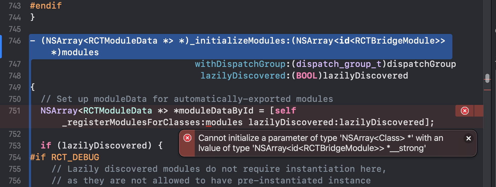

# Bug fix for react native 0.59.10

### bug fix for xcoe14.3


### bug fix for fishhook


### bug fix in RCTCxxBridge



# integration with pod 
```
  pod 'Folly', :git => 'https://github.com/pencilCool/RN5910.git'
  pod 'yoga',  :git=> 'https://github.com/pencilCool/RN5910.git'
  pod 'React', :git => 'https://github.com/pencilCool/RN5910.git',:subspecs => [
   'Core',
   'ART',
   'CxxBridge', 
   'DevSupport', 
   'RCTNetwork',
   'RCTText',
   'RCTWebSocket', 
   'RCTAnimation', 
   'RCTGeolocation', 
   'RCTImage',
   'RCTBlob',
   'RCTActionSheet',
   'RCTSettings',
   'RCTVibration',
   'RCTPushNotification',
   'RCTLinkingIOS',
   'RCTCameraRoll'
   ]

```